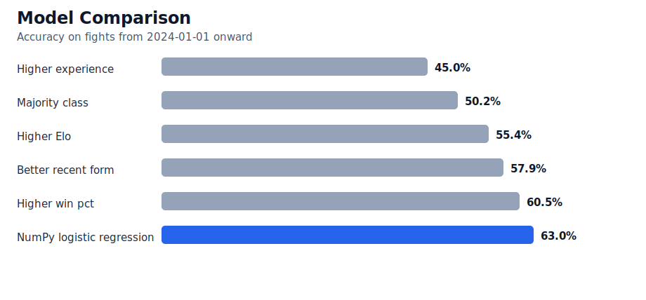
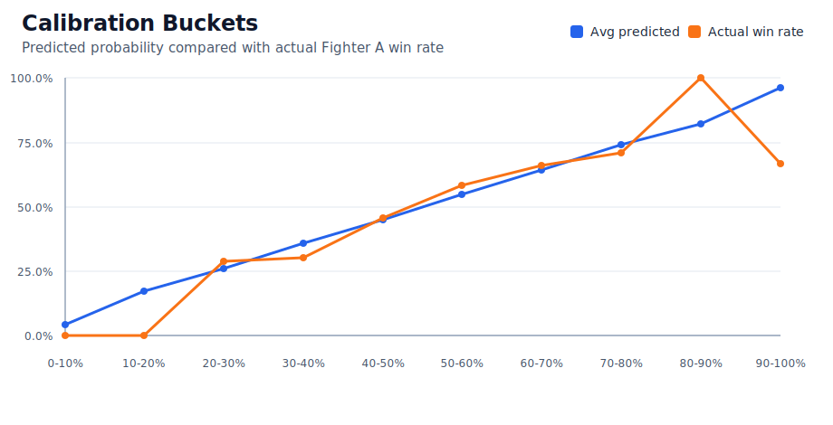
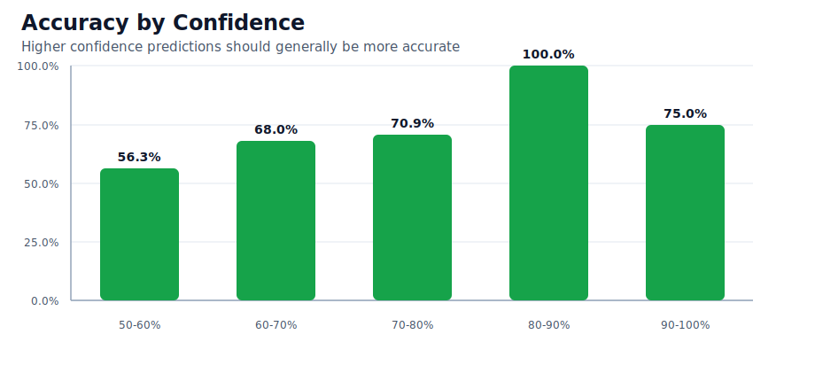

# UFC Fight Predictor

[](https://github.com/ArjunAdelaide/UFC-Fight-Predictor/actions/workflows/tests.yml)

A Python machine learning project for predicting UFC fight outcomes from
historical fighter data.

The project predicts a matchup in the form:

```text
fighter_a vs fighter_b -> probability that fighter_a wins
```

The current version is intentionally focused on a reliable modeling pipeline:
chronological feature engineering, leakage-safe historical fighter profiles, a
date-based train/test split, and a transparent NumPy logistic regression
baseline.

## Current Baseline

The current NumPy logistic regression baseline achieves **63.0% accuracy** and
**0.648 log loss** on a future-dated test split, compared with a **50.2%**
majority-class baseline.

## Highlights

- Builds pre-fight features from historical data only
- Processes fights chronologically to avoid data leakage
- Handles the raw dataset's winner/loser column structure safely
- Randomly orients fights into neutral `fighter_a` / `fighter_b` matchups
- Augments training with flipped matchup rows for orientation symmetry
- Tracks both simple Elo and method-adjusted Elo fighter ratings
- Trains a logistic regression baseline implemented with NumPy
- Compares the baseline against several scikit-learn models
- Evaluates with a future-dated train/test split
- Provides a CLI for predicting future matchups

## Results

Current baseline performance on a date-based test split:

| Model / Rule | Accuracy | Log Loss |
| --- | ---: | ---: |
| NumPy logistic regression | 63.0% | 0.648 |
| Majority class baseline | 50.2% | - |
| Higher Elo rule | 55.4% | - |
| Higher win percentage rule | 60.5% | - |
| Better recent form rule | 57.9% | - |

Split:

```text
train: fights before 2024-01-01
test:  fights on or after 2024-01-01
```

This split is designed to approximate the real use case: training on past
fights and evaluating on future fights.

## Stronger Model Comparison

Several scikit-learn models were tested on the same date-based split. The
current NumPy logistic regression baseline remains the selected model because it
has the best log loss and Brier score.

| Model | Accuracy | Log Loss | Brier |
| --- | ---: | ---: | ---: |
| NumPy logistic regression | 63.0% | 0.648 | 0.228 |
| sklearn logistic regression C=0.1 | 63.2% | 0.648 | 0.228 |
| sklearn logistic regression C=1.0 | 63.1% | 0.649 | 0.229 |
| GradientBoosting | 60.3% | 0.655 | 0.232 |
| HistGradientBoosting | 60.7% | 0.656 | 0.232 |
| RandomForest | 60.8% | 0.665 | 0.236 |

The comparison can be regenerated with:

```bash
python3 src/compare_models.py --use-existing-features
```

## Visual Summary







## Methodology

The raw CSV stores each fight with:

```text
fighter_1 = winner
fighter_2 = loser
```

Training directly on those columns would create a trivial and useless target,
because `fighter_1` always wins. To avoid that, each fight is converted into a
neutral matchup:

```text
fighter_a vs fighter_b -> fighter_a_wins
```

For each historical fight, the row is randomly oriented:

- `fighter_a = winner`, `fighter_b = loser`, `fighter_a_wins = 1`
- or `fighter_a = loser`, `fighter_b = winner`, `fighter_a_wins = 0`

For model fitting, the training split is also augmented with the flipped version
of each training row. The future-dated test split is not augmented, so evaluation
still uses one row per historical fight.

The feature pipeline also avoids using post-fight information from the fight
being predicted. Stats such as method, round, finish time, knockdowns,
significant strikes, takedowns, and control time are only used after the
training row has been created, when updating each fighter's history for later
fights.

At a high level:

```text
sort fights by date
for each fight:
  build pre-fight profiles for both fighters
  create fighter_a vs fighter_b features
  assign fighter_a_wins target
  update fighter histories with the completed fight
```

For a deeper explanation of the modeling choices, see
[`docs/methodology.md`](docs/methodology.md). For shorter beginner notes, see
[`LEARNING_NOTES.md`](LEARNING_NOTES.md).

## Features

The model mostly sees matchup differences:

```text
fighter_a value - fighter_b value
```

Examples include:

- age, height, reach, weight, and reach-to-height differences
- total fights, wins, losses, and win percentage differences
- finish, KO/TKO, submission, and decision win-rate differences
- striking, takedown, knockdown, and control-time historical rates
- current streak, longest win streak, and recent form
- days since last fight
- simple Elo difference
- method-adjusted Elo difference

Categorical inputs include:

- weight class
- Fighter A stance
- Fighter B stance
- stance matchup

## Project Structure

```text
.
|-- LEARNING_NOTES.md
|-- README.md
|-- pyproject.toml
|-- requirements.txt
|-- .github
|   `-- workflows
|       `-- tests.yml
|-- data
|   `-- .gitkeep
|-- docs
|   `-- methodology.md
|-- src
|   |-- compare_models.py
|   |-- feature_engineering.py
|   |-- generate_charts.py
|   |-- predict_matchup.py
|   |-- train_baseline.py
|   `-- ufc_predictor
|       |-- artifacts.py
|       |-- charts.py
|       |-- config.py
|       |-- data.py
|       |-- domain.py
|       |-- evaluation.py
|       |-- features.py
|       |-- model.py
|       |-- model_comparison.py
|       |-- prediction.py
|       |-- preprocessing.py
|       |-- reporting.py
|       `-- training.py
|-- tests
|   |-- test_artifacts.py
|   |-- test_feature_engineering.py
|   |-- test_predict_matchup.py
|   `-- test_train_baseline.py
`-- outputs
    |-- charts
    |   |-- calibration_buckets.svg
    |   |-- confidence_buckets.svg
    |   `-- model_comparison.svg
    |-- baseline_coefficients.csv
    |-- calibration_buckets.csv
    |-- confidence_buckets.csv
    |-- sklearn_model_comparison.csv
    |-- baseline_logistic_model.npz
    |-- current_fighter_profiles.pkl
    |-- baseline_metrics.csv
    |-- model_report.md
    `-- prefight_features.csv
```

## Setup

Install dependencies:

```bash
pip install -r requirements.txt
```

For local development, you can also install the package in editable mode:

```bash
pip install -e .
```

The current code expects a cleaned UFC dataset CSV. The recommended public
workflow is to supply the local dataset path with `--data`:

```bash
python3 src/train_baseline.py --data data/clean_ufc_dataset.csv
```

You can also set an environment variable:

```bash
UFC_DATASET_PATH=data/clean_ufc_dataset.csv python3 src/train_baseline.py
```

If no path is supplied, the fallback path is:

```python
DEFAULT_DATASET_PATH = PROJECT_ROOT / "data" / "clean_ufc_dataset.csv"
```

The dataset itself is intentionally ignored by Git. Place a local copy in
`data/` or pass the path to wherever it lives on your machine.

## Training

Run from the project root:

```bash
python3 src/train_baseline.py --data data/clean_ufc_dataset.csv
```

Training creates or updates:

```text
outputs/prefight_features.csv
outputs/baseline_metrics.csv
outputs/baseline_coefficients.csv
outputs/calibration_buckets.csv
outputs/confidence_buckets.csv
outputs/baseline_logistic_model.npz
outputs/current_fighter_profiles.pkl
outputs/model_report.md
```

Output files:

| File | Purpose |
| --- | --- |
| `prefight_features.csv` | Leakage-safe model dataset |
| `baseline_metrics.csv` | Accuracy, log loss, Brier score, and baseline comparisons |
| `baseline_coefficients.csv` | Learned logistic regression coefficients |
| `calibration_buckets.csv` | Predicted probability buckets vs. actual Fighter A win rate |
| `confidence_buckets.csv` | Accuracy grouped by model confidence |
| `baseline_logistic_model.npz` | Saved model artifact used by the prediction CLI |
| `current_fighter_profiles.pkl` | Cached latest fighter histories for faster prediction |
| `model_report.md` | Markdown summary of the latest training run |

The generated [model report](outputs/model_report.md) summarizes the latest
dataset split, metrics, calibration buckets, confidence buckets, and largest
coefficients.

To regenerate the SVG charts after training, run:

```bash
python3 src/generate_charts.py
```

To regenerate the scikit-learn model comparison, run:

```bash
python3 src/compare_models.py --use-existing-features
```

## Prediction

Train the model first. This creates both the saved model and a cache of current
fighter profiles.

Then run:

```bash
python3 src/predict_matchup.py "Islam Makhachev" "Ilia Topuria" --date 2026-06-03 --weight-class Lightweight
```

By default, prediction loads `outputs/current_fighter_profiles.pkl` instead of
rebuilding fighter histories from the CSV. To force a rebuild from the dataset,
use:

```bash
python3 src/predict_matchup.py "Islam Makhachev" "Ilia Topuria" --date 2026-06-03 --weight-class Lightweight --data data/clean_ufc_dataset.csv --rebuild-profiles
```

Example output:

```text
Prediction
  Islam Makhachev: 63.9%
  Ilia Topuria: 36.1%
  fight date: 2026-06-03
  weight class: Lightweight
  profiles: loaded from outputs/current_fighter_profiles.pkl

Quick comparison
  Elo: Islam Makhachev 1740 vs Ilia Topuria 1656
  Record in dataset: Islam Makhachev 17-1 vs Ilia Topuria 9-0
  Recent win pct: Islam Makhachev 1.00 vs Ilia Topuria 1.00
```

The first fighter passed to the CLI is `fighter_a`, so the reported probability
answers:

```text
What is the probability that fighter_a beats fighter_b?
```

## Tests

GitHub Actions runs the test suite automatically on pushes and pull requests to
`main`.

Run the test suite with:

```bash
python3 -m unittest discover -s tests
```

The current tests focus on the most important ML safety checks:

- `fighter_a_wins` matches the randomized Fighter A / Fighter B orientation
- current-fight post-fight stats do not leak into that fight's pre-fight row
- method-adjusted Elo moves more for finishes than decisions
- saved model artifacts preserve arrays and metadata on round trip

## Limitations

This is a baseline model and does not currently include:

- betting odds
- UFC rankings
- injury context
- short-notice fight information
- weight misses
- fight camp or team data
- title fight or main event flags
- opponent-quality adjusted statistics
- opponent-quality adjusted ratings

Cached fighter profiles make predictions faster after training, but the cache
must be regenerated when the underlying dataset changes.

## Roadmap

- Reduce overlapping features for clearer coefficient interpretation
- Explore rolling-window features and keep only those that improve validation
- Improve Elo with recency, opponent-quality, and weight-class adjustments
- Compare against scikit-learn, tree-based models, XGBoost, or LightGBM
- Add external data such as odds, rankings, injuries, and weight misses

## Disclaimer

This project is for machine learning experimentation and sports analytics
practice. It is not betting advice. Combat sports are noisy, high-variance, and
affected by many factors that are not included in the current dataset.
